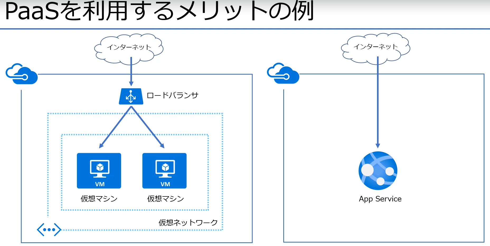
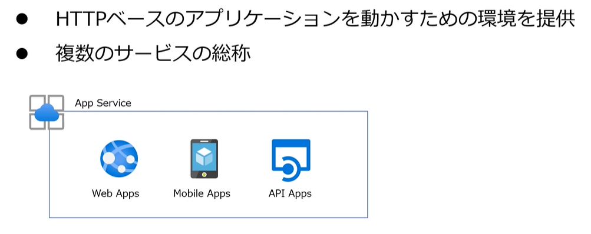
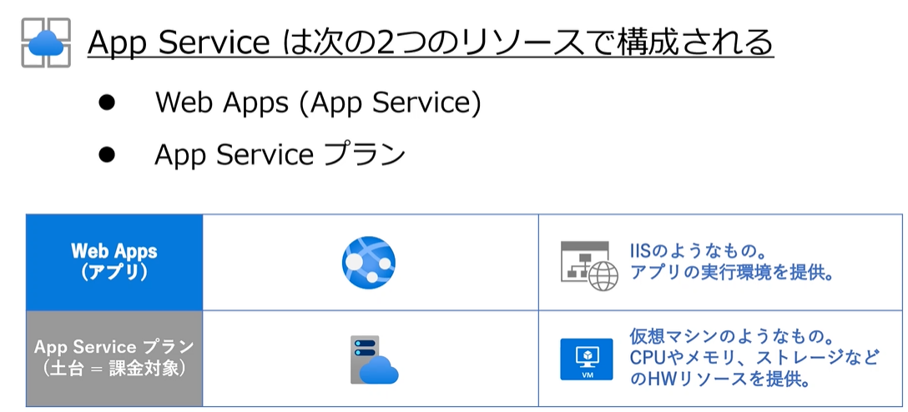
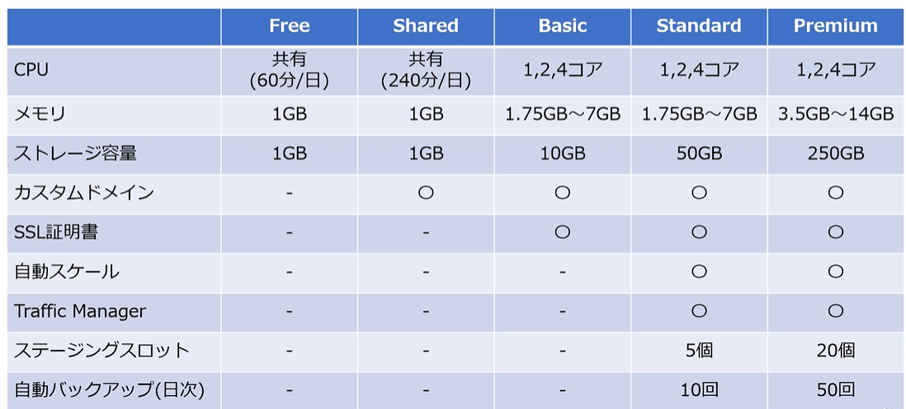

# Azure PaaS の概要と作成のメモ

## AppService の整理

### Appserviceとは

- Webアプリケーションの実行環境を提供

※他にも同じアーキテクチャーである AzureFunction、LogicApps

### AppServiceの構成

- App Serviceプランを作成して利用する

### AppServiceのプラン

- プランのサイズによってHWリソースの量、オプション機能、価格が決定する

## WebApps の作成手順

1. リソースグループ作成
2. AppServiceの作成
3. Webの設定
   1. KudoによるHTMLファイルの作成
   2. スケールの設定

- Kudu（クードゥツールがある）

## 補足資料

ソース管理に
- Kudu（クードゥツールがある）

- dig DNSの動作確認
- sqlcmd SQLServer への接続確認
- git サンプルアプリをデプロイ
