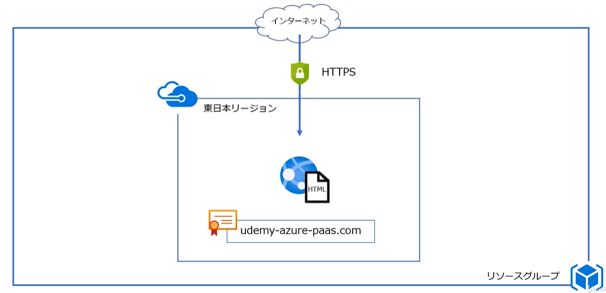
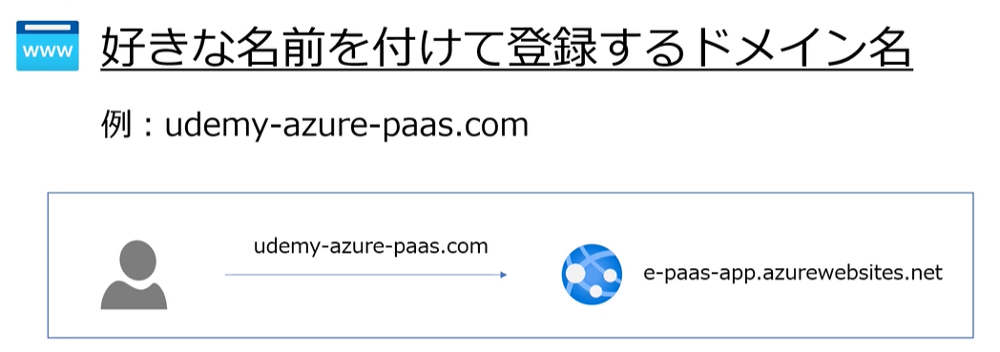
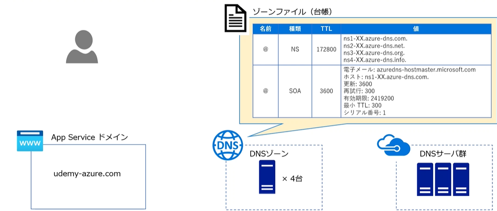
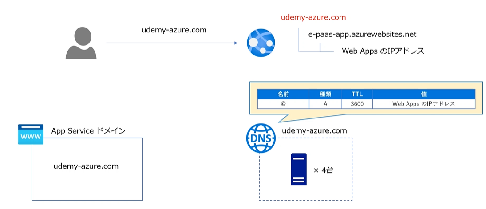
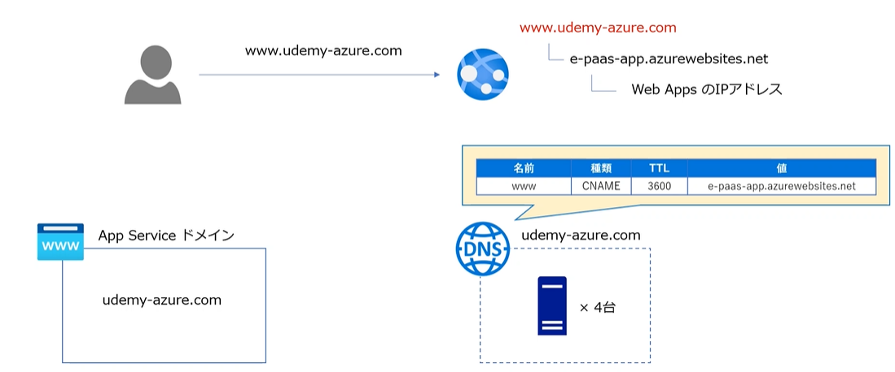
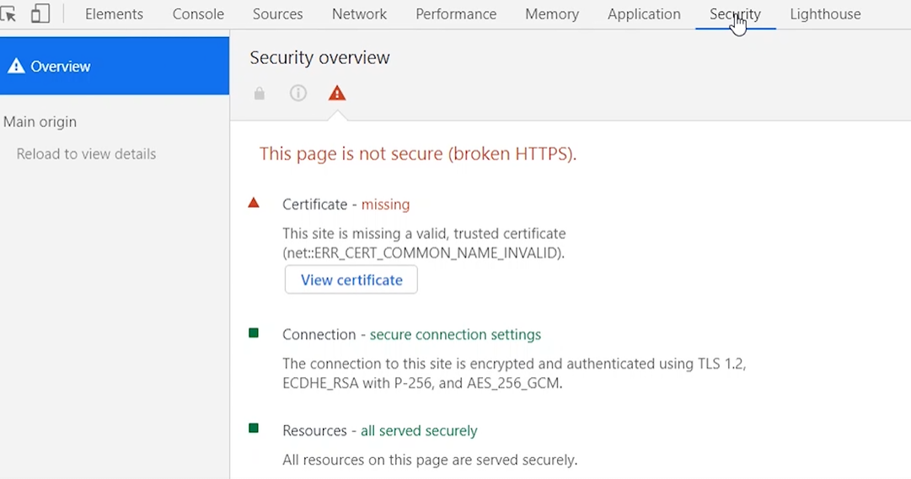
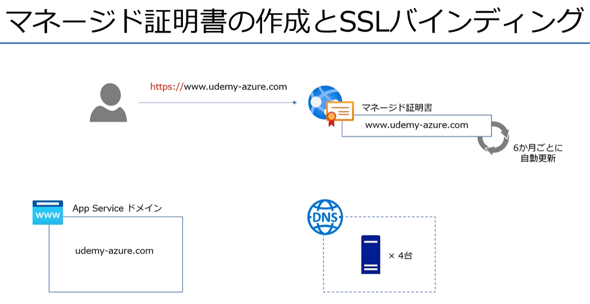
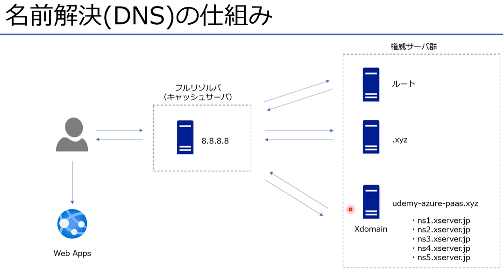
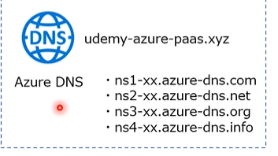

# Azure PaaS の概要と作成のメモ

## AppService の整理

### Appserviceとは

- Webアプリケーションの実行環境を提供

※他にも同じアーキテクチャーである AzureFunction、LogicApps

### AppServiceの構成

- App Serviceプランを作成して利用する

### AppServiceのプラン

- プランのサイズによってHWリソースの量、オプション機能、価格が決定する

## WebApps の作成手順

1. リソースグループ作成
2. AppServiceの作成
3. Webの設定
   1. KudoによるHTMLファイルの作成
   2. スケールの設定

- Kudu（クードゥツールがある）

## カスタムドメイン

- カスタムドメインとは

独自ドメインともいう   
ドメインの取得は料金がかかる  
ドメインの目的
- IPアドレスの代わりに名前をつける
- ブランドイメージとして認知してもらう

ドメインの取得方法
1. Azureのサービス（AppServiceドメイン）
   - Azureで完結できて管理（設定）が楽
   - ５日以内にキャンセル可能
   - 無料アカウントでは登録できない
2. 外部のドメインサービス利用（Xdomain、お名前.com）
   - 価格が易い
   - 登録後のキャンセルは基本的に付加
   - 別途、アカウントの登録が必要

### ドメインを取得するということは

作成すると
- ドメインリソース
  - ドメイン自体
- DNSゾーンリソース
  - ドメインのDNS　DNSサーバが管理する自らの範囲を指す
    - NSレコード /// 取得したドメインのネームサーバを指す
    - SOAレコード /// 管理情報
    - Aレコード　ドメインとIPアドレスを紐づけたもの
    - CNAMEレコード　別の名前をつけるレコード
が作成される。

- Aレコードの場合

- CNAMEレコードの場合

## SSLバインディング

- SSLの状態の確認
F12 ツールで「Security」タブを確認

- Certificate
  - 証明書が正当か
- Connection
  - SSLのプロトコルや暗号化方式が安全か確認可能
- Resources
  - 画像やJavaScriptが暗号化されているか確認

- マネージド証明書とは
  - AppServiceのオプション機能
  - 2020年5月現在プレビュー中
  - 設定が簡単
  - 無料で利用できる

証明書をドメインに対して割り当てることを、バインドとかバインディングと呼ぶ  
証明書は  
IPアドレスに対してつける：IPベースのSSL  
SNI SSL : ドメインに対してSSLをつける  主流 ★

## 外部ドメインを利用する場合

- ドメインを取得
- DNSゾーンの作成（手動でDNSゾーンを作成）
  - DNSゾーンの設定
  - NS(ネームサーバ)のドメインサーバを外部ドメインサーバに設定する
  - 確認(設定反映に数時間～かかる)
    - dig [ドメイン名] ns +short
- カスタムドメインの設定
  - DNSゾーンにCNAMEレコードを設定する

## 補足資料

ソース管理に
- Kudu（クードゥツールがある）

- dig DNSの動作確認
- sqlcmd SQLServer への接続確認
- git サンプルアプリをデプロイ

作成者gitURL
- [作りながら覚えるMicrosoftAzure入門講座(PaaS編)](https://github.com/m-oka-system/udemy-azure-paas)

