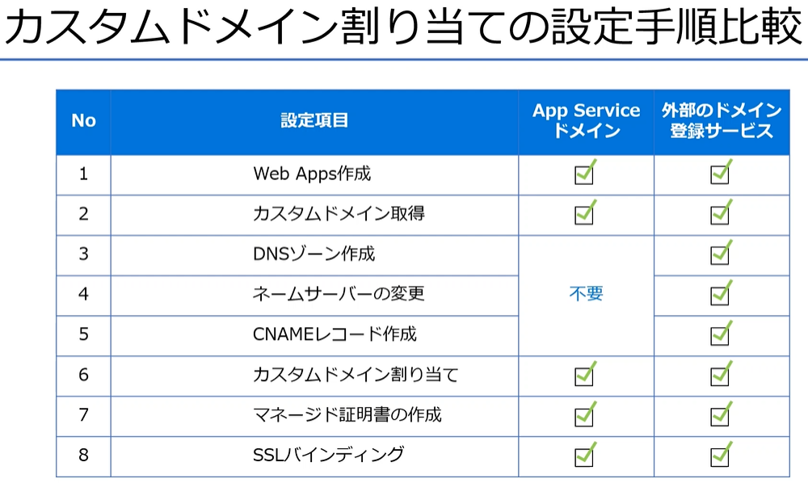
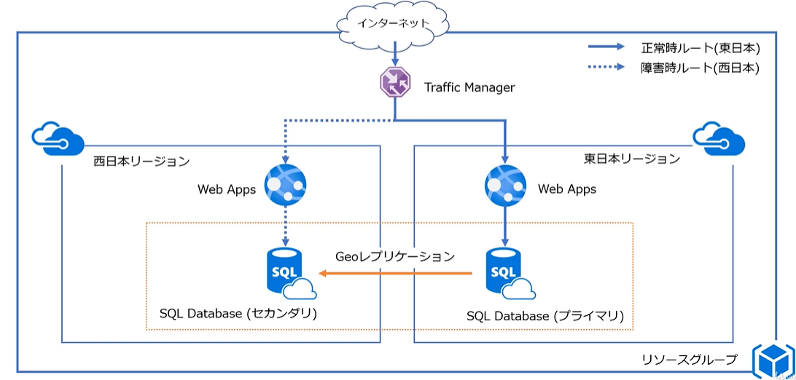
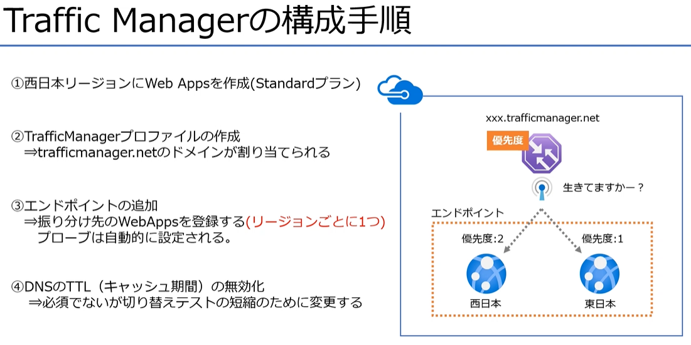
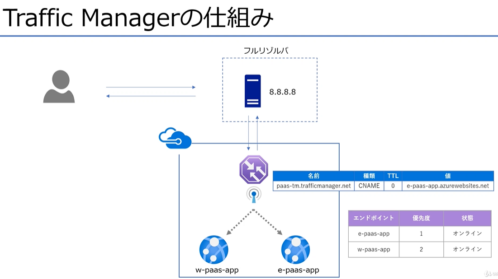

# Azure PaaS の概要と作成のメモ


## AppService の整理

### Appserviceとは

- Webアプリケーションの実行環境を提供

※他にも同じアーキテクチャーである AzureFunction、LogicApps

### AppServiceの構成

- App Serviceプランを作成して利用する


### AppServiceのプラン

- プランのサイズによってHWリソースの量、オプション機能、価格が決定する


## WebApps の作成手順

1. リソースグループ作成
2. AppServiceの作成
3. Webの設定
   1. KudoによるHTMLファイルの作成
   2. スケールの設定

- Kudu（クードゥツールがある）

## カスタムドメイン


- カスタムドメインとは

独自ドメインともいう   
ドメインの取得は料金がかかる  
ドメインの目的
- IPアドレスの代わりに名前をつける
- ブランドイメージとして認知してもらう


ドメインの取得方法
1. Azureのサービス（AppServiceドメイン）
   - Azureで完結できて管理（設定）が楽
   - ５日以内にキャンセル可能
   - 無料アカウントでは登録できない
2. 外部のドメインサービス利用（Xdomain、お名前.com）
   - 価格が易い
   - 登録後のキャンセルは基本的に付加
   - 別途、アカウントの登録が必要


### ドメインを取得するということは


作成すると
- ドメインリソース
  - ドメイン自体
- DNSゾーンリソース
  - ドメインのDNS　DNSサーバが管理する自らの範囲を指す
    - NSレコード /// 取得したドメインのネームサーバを指す
    - SOAレコード /// 管理情報
    - Aレコード　ドメインとIPアドレスを紐づけたもの
    - CNAMEレコード　別の名前をつけるレコード
が作成される。

- Aレコードの場合


- CNAMEレコードの場合


## SSLバインディング

- SSLの状態の確認
F12 ツールで「Security」タブを確認


- Certificate
  - 証明書が正当か
- Connection
  - SSLのプロトコルや暗号化方式が安全か確認可能
- Resources
  - 画像やJavaScriptが暗号化されているか確認

- マネージド証明書とは
  - AppServiceのオプション機能
  - 2020年5月現在プレビュー中
  - 設定が簡単
  - 無料で利用できる

証明書をドメインに対して割り当てることを、バインドとかバインディングと呼ぶ  
証明書は  
IPアドレスに対してつける：IPベースのSSL  
SNI SSL : ドメインに対してSSLをつける  主流 ★


## 外部ドメインを利用する場合


- ドメインを取得
- DNSゾーンの作成（手動でDNSゾーンを作成）
  - DNSゾーンの設定
  - NS(ネームサーバ)のドメインサーバを外部ドメインサーバに設定する
  - 確認(設定反映に数時間～かかる)
    - dig [ドメイン名] ns +short
    - or 'nslookup -type=ns example.com'
- カスタムドメインの設定
  - DNSゾーンにCNAMEレコードを設定する


独自ドメインとの比較



## 東西リージョンへの冗長化 (Traffic Manager)



- Traffic Manager とは
  - DNS機能により宛先サーバの振り分けを行うロードバランサ
  - 振り分け先のサーバの正常性を監視する（プローブ）
  - 様々なルーティング方法を提供
    - 優先度
    - 重みづけ
    - パフォーマンス
    - 地域
    - 複数値
    - サブネット

- 一般的な負荷分散であれば、重みづけで
- 障害対応であれば優先度

プロキシサーバではなく、DNSみたいな動き





### Traffic Manager 概要
- Traffic Manager は DNS レベルでトラフィックを分散する
  - 宛先サーバへの通信をプロキシ（中継）することはない
- エンドポイント（振り分け先）の正常性を監視する機能がある
- 設定したルーティング方法によって振り分けをする
- 費用は微々たるもの月１００円前後

### Traffic Manager プロファイル

グローバルのリソース

手順
- traffic Manager プロファイルの作成
  - ドメインの作成
  - エンドポイントの作成（Azureエンドポイント）
  - 構成設定
    - DNS Time to Live(TTL) キャッシュの設定

接続確認コマンド
```bash
curl [url]
```
その他の情報
- [入れ子のTraffic Manager プロファイル](https://learn.microsoft.com/ja-jp/azure/traffic-manager/traffic-manager-nested-profiles)


## 補足資料

### ソース管理
- Kudu（クードゥツールがある）


- dig DNSの動作確認
- sqlcmd SQLServer への接続確認
- git サンプルアプリをデプロイ

作成者gitURL
- [作りながら覚えるMicrosoftAzure入門講座(PaaS編)](https://github.com/m-oka-system/udemy-azure-paas)


  
### 用語などメモ

- www.example.com のようにホスト名(www)を付与したドメインを「サブドメイン」と呼びますが、
example.com のような(ホスト名なしの)ドメインのことを何と呼ぶでしょうか？1つ以上回答してください。
  - ネイキッドドメイン
  - ルートドメイン
  - ZoneApex
- Web Appsにカスタムドメインを割り当ててSSL化する手順
  - カスタムドメインの割り当て(www.example.com / CNAMEレコード)
  - マネージド証明書の作成
  - SSLバインディング
