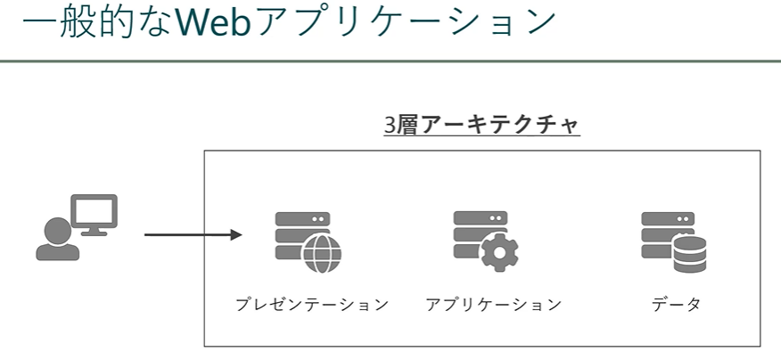
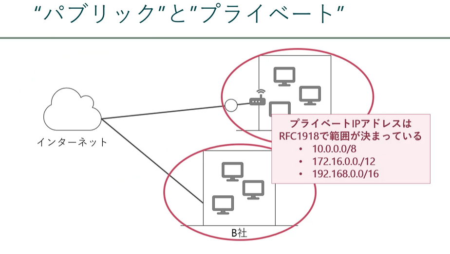
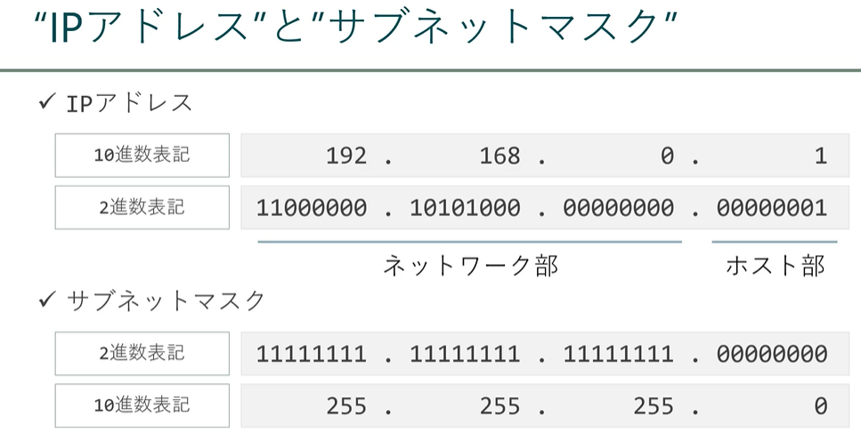
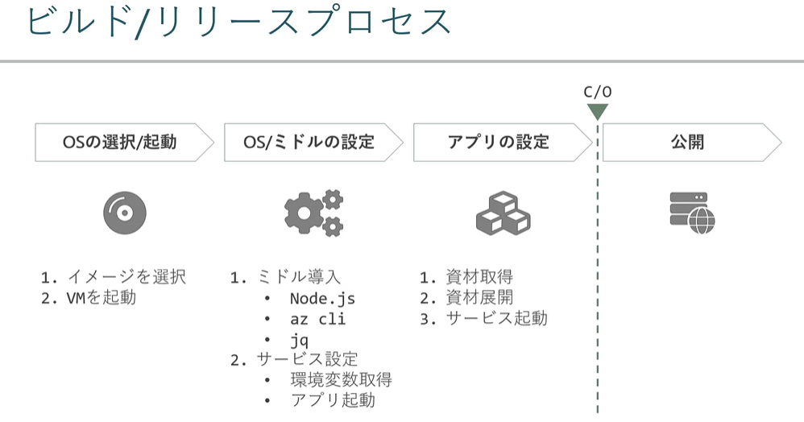
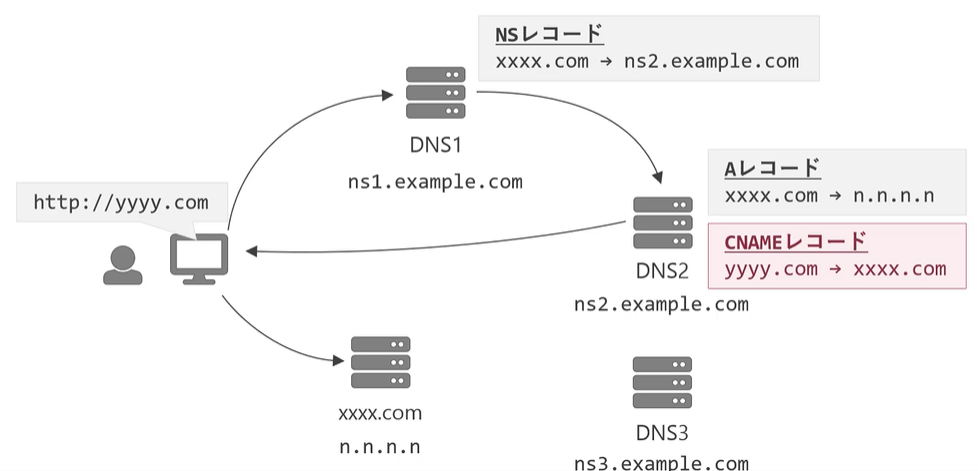

# Azure で作るWebアプリケーション

## 概要

Udemyの講座の整理
- [Azure で作る Webアプリケーション 実践講座](https://www.udemy.com/course/webapplication-on-azure/)
- Azure上に実業務を想定したWebアプリケーション（Node.js + MySQL）の構築

## 目的

Azure 上の VM に Node.js アプリを作成することで、Azure上のWeb開発を理解する

## 講座概要

- Web アプリの構築
  - ネットワーク
  - アプリサーバ
  - データベース
  - 秘匿情報
  - 負荷分散
  - 独自ドメイン/証明書
  - キャッシュサーバ
  - モニタリング
  - オートスケール
  - ユーザ管理
  - 踏み台サーバ


※以下利用料金は注意する

- Azure Bastion
- Application Gateway
- Azure Database for MySQL

- ドメイン

---

## 基礎知識

### アカウントの種類の違い


### Azure の初期設定：アカウントを作成したら

- 多要素認証の設定を行う
- 作業用ユーザを作成する
  - ADからユーザの作成
  - ロール：グローバル管理者（Admin権限みたいなもの）
  - サブスクリプションにIAM で共同管理者を追加する（追加したユーザ）
- 作業用アカウントの初期設定
  - 新ユーザでログイン
  - 多要素認証を設定
- 料金アラートの作成
  - サブスクリプションを選択
  - 「予算」の追加
  - 「通知」の設定（メール）
- 監査ログの確認
  - ログの種類


※1. ログの種類


---

## 作成するアプリケーション（お試し）

### 概要

- VM 上に NGINX(WEBサーバ) を作成する

### 手順

- VM の作成
- SSH で接続

``` powershell
ssh azure-user@20.89.107.75
```

- [NGINXインストール](https://gakumon.tech/nginx/nginx_install_basic_ubuntu_3.html)
  - index.html : /usr/share/nginx/html
  - 設定ファイル : /etc/nginx/nginx.conf、　/etc/nginx/conf.d/default.conf
  - ログファイル : /var/log/nginx
    - 確認 : curl localhost

---

## Azureの基礎用語


- サブスクリプション
  - 支払い単位
- SKU（Stock Keep Unit）
  - 価格レベル


アーキテクチャアイコンの取得先
- [マイクロソフト公式](https://learn.microsoft.com/ja-jp/azure/architecture/icons/)
- マイクロソフトUXパターン
- drow.io

### 責任共有モデル


ネットワーク設計や設定、ストレージ上のデータ冗長性などはユーザ責任

---

## 講座で作成する Web アプリ




## Azure 環境構築

作成するもの

- リソースグループ
  - 一覧で対象が管理可能
- ネットワークの作成
  - VNetの作成（閉域網の作成が可能）
    - VNet の中はネットワークが通じる、VNet 間は Peering でつなぐこともできる
  - サブネットの作成
    - VNet 内の CIDR 範囲の中で作られる小分けのネットワーク
  - ネットワークセキュリティーグループ NSG
    - トラフィックフィルター（送信元先、ポート、プロトコル）
    - 基本的にはサブネット単位で作成する
      - WEB : インバウンド(HTTP/TCP 80,443)
      - AP : インバウンド（SSH TCP 22、TCP 3000）
      - Bastion通信 : インバウンド HTTP TCP 80, Bastion通信(TCP 8080, 5701)
        - アウトバウンド : SSH TCP22、RDP　TCP 3389、 HTTP TCP80、443、Bastion通信 TCP 8080, 5701


### ネットワークの基礎




- パブリックIPとプライベートIPを変換するのが **ルータ** となる
- プライベートIPアドレスはRFC1918 で範囲が決まっている
  - 10.0.0.0/8
  - 172.16.0.0/12
  - 192.168.0.0/16




#### Azure の VNet構成でよくあるイメージ

- ハブアンドスポーク型


- インバウンドのデフォルト
  - VNet
  - LoadBalancer
- アウトバウント
  - VNet
  - インターネット


### ARM テンプレート


1. テンプレートを作成
2. カスタムテンプレートのデプロイ を選択する
3. デプロイする

## アプリケーションサーバの作成

条件

- VM上に作成


認識ポイント

- インスタンスサイズの名称の意味
  - たとえば D3s-v3 なら
    - D : インスタンスファミリー（目的ごとに異なる）注1
    - 2 : CPUコア数
    - s : 補足情報
    - V3 : バージョン

#### VM 補足ポイント

- インスタンスファミリー


- 補足情報


- VMのマネージドディスク
  - ポータルから作成する場合は、デフォルトサイズになる (Win:127GB、Linux:30G)
  - マネージディスクはネットワーク越しに配置されるため、ネットワークの影響を受ける
  - 補足情報に d のＶＭを選ぶと、一時ディスクのディスクが配置される（キャッシュ向け）
  - イメージは、マーケットプレイスまたはイメージギャラリーから作成する


#### その他補足

- SSH 接続
  - 引数
    - -i <KEYFILE>  接続に利用するキーペアの鍵ファイル
    - -p <PORT>     ポート番号（デフォルト 22）
    - <USER_NAME>   接続したい VM のユーザ名
    - <PUBLIC_IP>   接続したい VM のパブリックIPアドレス

``` bash
ssh [-i <KEYFILE>][-p <port>] <USER_NAME>@<PUBLIC_IP>
```

- SCP 接続（アップロード）
  - 引数
    - -i <KEYFILE>  接続に利用するキーペアの鍵ファイル
    - <SOURCE>      転送したいローカルファイル
    - <USER_NAME>   接続したい VM のユーザ名
    - <PUBLIC_IP>   接続したい VM のパブリックIPアドレス
    - <TARGET>      転送先フォルダ

``` bash
scp -i <KEYFILE> <SOURCE> <USER_NAME>@<PUBLIC_IP>:<TARGET>
```

- SCP 接続（ダウンロード）
  - 引数
    - -i <KEYFILE>  接続に利用するキーペアの鍵ファイル
    - <USER_NAME>   接続したい VM のユーザ名
    - <PUBLIC_IP>   接続したい VM のパブリックIPアドレス
    - <TARGET>      ダウンロードしたいファイルパス
    - <LOCAL>       保存先ローカルパス

``` bash
scp -i <KEYFILE> <USER_NAME>@<PUBLIC_IP>:<TARGET> <LOCAL>
```

## アプリケーションのビルド/リリース



- ミドル導入
  - アプリケーション実行の言語環境、フレームワーク
- サービス設定
  - Linux系のシステム起動時に自動実行、アプリ終了時に自動再起動を行う
  - サービス設定（systemd）設定の実態
    - systemdが利用するユニットファイルの作成と、systemdへユニットファイルを登録
      - 例：環境変数取得(load-params)、アプリ起動(tastylog)

### Linuxにおけるサービス

#### Linux の起動プロセス


- systemd
  - Linux起動時に実行されサービスを管理するもの
  - 実態は、ユニットファイルと呼ばれる定義ファイルにしたがって実行管理する
  - サービスファイルが作られれば、サービスが作られる


- [unit]
  - Description : 説明
  - After : 依存関係、サービスの起動の条件
- [Service]
  - Type : 実行方法の定義
    - simple : デフォルト、ExecStart のコマンドがそのままメインプロセス（シェル等）
    - forking : ExecStat の子プロセスがメインプロセス
    - oneshot : 1度だけ実行するスクリプト
    - notify : simple と同じだが、利用可能となった時 systemd へ通知を送るプロセス
  - EnvironmentFile : サービス実行時の読み込まれる環境変数
  - ExecStart : サービスの実行コマンド
  - Restart : アプリ停止時の再起動設定
- [Install]
  - WantedBy : 通常利用は multi-user.target でよい

#### 実際のコマンド例

- サービス登録

ユニットファイルを置いて、systemd に読み込ませるのが流れ

1. ユニットファイルの配置

```bash
/etc/systemd/system/<UNIT_FILE>
```

2. systemd に対して読込実行

```bash
systemctl daemon-reload
```

- 登録されたかの確認（サービス一覧表示/状態確認）

```bash
# サービス一覧表示
systemctl list-unit-files

# サービス状態確認
systemctl status <UNIT_NAME>

```

- サービスの開始終了/自動起動設定

  - サービス開始/終了

```bash
# 開始
systemctl start <UNIT_NAME>
# 終了
systemctl stop <UNIT_NAME>
```

  - サービスの自動起動の有効/無効

```bash
# 有効
systemctl enable <UNIT_NAME>
# 無効
systemctl disable <UNIT_NAME>
```

## 実際のAPサーバ構築


### 参考

tar 解凍

```bash
tar zxvf <圧縮ファイル> -C <解凍先ディレクトリ>

```

## データベース作成

### Azure Database for MySQL

- 種類
  - PaaS 型マネージド MySQL
  - 単一サーバ
  - フレキシブルサーバ
    - 運用ではこちらがおすすめ
- 配置場所
  - パブリックに配置される
  - 対処方法
    - 以下いずれかのアクセス制限をかける
      - ファイアウォールでアクセス制限（デフォルト）
      - 閉域アクセスを有効化する（VNet 統合を利用する）

#### 閉域アクセス


- VNet 統合とは
  - 特定のサブネットからのみアクセス可能にすること

#### MySQL の可用性の種類


#### Azure Database for MySQL サーバの構築

- Azure Database for MySQL を作成
  - フレキシブルを選択
  - VNet統合を選択し、サブネットを指定する

- Application サーバにMySQL Client をインストール

1. Oracle アカウント作成
2. [MySQL Community のページ](https://dev.mysql.com/downloads/)から RPM の URL を取得
   1. Red Hat Enterprise Linux 7 / Oracle Linux 7 (Architecture Independent), RPM Package を選択  
   [ダウンロードリンク](https://dev.mysql.com/get/mysql80-community-release-el7-7.noarch.rpm)

3. MySQL のダウンロード

```bash
yum localinstall -y <RPM_URL>
```

4. MySQL Client のインストール

```bash
yum install -y mysql-community-client
```

#### APサーバから DB へ接続

MySQL 接続コマンド

```bash
mysql -u<USER> -p<PASSWORD> -h<HOST> -P<PORT>
# 注意：パラメタはスペースを開けない
```

- USER : ユーザ名
- PASSWORD : パスワード
- HOST : ホスト名またはIPアドレス
- PORT : ポート番号（デフォルト 3306）

接続したらデータベース確認

```mysql
show databases;
```

その他コマンド例

```mysql
use <database_name_>;
show tables;
```

#### DB バックアップ

Azure Database for MySQL のバックアップはデータファイルのスナップショット


- スナップショットはローカル冗長ストレージに保存
- "自動"で取得され、"手動"取得はできない
- スナップショットはDB削除時に消える
- バックアップは 1日 ～ 35日で選択可能（デフォルト7日）
- スナップショットは１日１回作成
  - トランザクションログバックアップが5分ごとに作成

- 確認方法
  - バックアップと復元 メニューで確認する

#### DB リストア

スナップショットを元に新しくサーバを起動する


1. 自動スナップショットの確認
2. DB接続してデータ改変

```mysql
UPDATE t_review SET score=1 WHERE id=1;
```

3. Azureポータルからリカバリを実施
   1. 「復元」から実行
4. リカバリしたDBへアクセスしてデータが戻っていることを確認
5. 復元したデータベースを削除

## 秘匿情報の管理（キーコンテナ）

### キーコンテナ（Key Vault）

Azure で扱う以下のような秘匿情報を管理するサービス

- キー
  - データの暗号化に使用する暗号化キー、VM のストレージ暗号化
- シークレット
  - DB サーバへの接続文字列
- 証明書
  - TLS/SSL の設定で利用する証明書など

使い方イメージ


#### キーコンテナの作成

1. キーコンテナを作成

```bash
<Projest>-<Env>-kv
```

2. DB接続情報を確認してキーコンテナに登録

```bash
MYSQL-HOST <ホスト名>
MYSQL-PORT  <3306>
MYSQL-DATABASE  <データベース名> ex.tastylog
MYSQL-USERNAME  <ユーザ名>
MYSQL-PASSWORD  <パスワード>

```

#### マネージドIDの作成とVMへの付与

1. マネージドID の作成

- マネージド ID サービスを作成

1. VM への付与

- VM メニューの [ID] を選択
- ユーザ割り当て済みに付与

#### キーコンテナへのアクセス制御設定

- シークレットに対して以下を付与
  - 取得
  - 一覧

1. キーコンテナにアクセスポリシーを設定

- キーコンテナへアクセス
- 「アクセスポリシー」を選択
- 「シークレット」から「取得」「一覧」を選択
- プリンシパルに、先ほどのマネージドIDを選択する

#### キーコンテナからシークレットを取得

概要

- az login
- az keyvault secret list
- az keyvault secret show

■ マネージドID によるログイン

```bash
az login --identity --allow-no-subscription
```

引数
  -- identity 仮想マシンに設定されたIDを使用してログイン
  -- allow-no-subscription  サブスクリプション指定なしでログイン

■ Keyvalt から情報を取得

```bash
# 一覧取得
az keyvault secret list --vault-name <KEYVAULT_NAME>
# 情報を取得
az keyvault secret show --vault-name <KEYVAULT_NAME> --name <SECRET_NAME>
```

引数
  --vault-name <KEYVAULT_NAME>  キーコンテナ（Key Vault）名を指定
  -- name <SECRET_NAME> シークレット名を指定
  -- output table <OPTION テーブル形式で出力>

### APサーバの再設定

■ 実施概要
1. キーコンテナに登録したDB接続情報を確認
2. VMのタグを追加
   1. 目的は、環境変数取得シェルから（load-params）でタグから情報を取得しているため  
      "\${Project}-${Env}-kv" という名前でキーコンテナへアクセスしているため
3. サービス（load-params、tastylog）を再起動
   1. 環境変数の取得（=load-params 再起動）  

      ```bash
      sudo systemctl start load-params
      ```

      取得した環境変数情報は以下に配置される（内容が読み込まれていることを確認）  
        /etc/params
   2. アプリで環境変数読み直し（=tastylog再起動）

      ```bash
      sudo systemctl restart tastylog
      ```

4. 動作確認

### 負荷分散

Azure が提供する負荷分散


- Load Balancer
  - L4ベース、プライベートがよく使われる
- Application Gateway
  - L7相当 SSl/TLS 終端もできる
- Traffic Manager
  - DNS ベースのグローバルな負荷分散
- Front Door
  - CDNを含むグローバルな負荷分散、WAFも追加できる

#### 実例イメージ

■ load Balancer（Private） の場合


■ Application Gateway

一般公開アプリの場合


■ Traffic Manager

リージョンレベルの災害対策


■ Front Door

リージョンレベルの災害対策+高速化


### Application Gateway の作成

#### 外部公開するため

1. Application Gateway の作成  

  ■ 設定項目  

- 配置用サブネット  : WEB用サブネット  
- フロントエンド    : パブリックIPを新規取得  
- バックエンド      : 作成済みVM  
- ルーティング規則  : HTTP(TCP80) を受けて TCP3000 へ転送


2. リソースの作成

- アプリケーションGWの作成
  - アプリケーションGWリソースを作成
  - フロントエンドのパブリックIP作成
  - バックエンドの指定（VM）
  - ルーティング規則の追加
    - リスナー
    - バックエンド

### 独自ドメイン/証明書

#### ■ DNS ゾーン

- ドメイン名（www.example.com） をパブリックIPアドレス（例:31.2.11.13）に変換するサービス。
- ドメイン名を使って Azure サービスへ接続できるようにする。

プライベートDNSゾーン（というサービスもある）

変換するIPアドレスがプライベートであること

イメージ


※DNSゾーンにはIPアドレスだけでなくエイリアスの指定もできる

DNS 概要イメージ



- NS レコード
  - ドメイン情報を保持しているDNSサーバ名の定義
- A レコード
  - ドメインをIPアドレスに変換する定義
- CNAME レコード
  - ドメインを別ドメインに置き換える定義

#### ■ ドメイン取得

[お名前ドットコム](https://www.onamae.com/)で取得

.work は 1 円

ドメイン名 : ryosukelly.com

で登録

#### ■ DNSゾーンの設定

1. DNS ゾーン作成
2. ドメイン取得元（お名前.com）に対する設定
   1. NS レコードの向き先を Azure のDNSゾーンへ向ける
3. DNSゾーンに「Aレコード（ドメイン → IP アドレスへの変換）」作成
   1. AzpplicationGateway へドメイン名でアクセスできるようにする
   2. 作成には「エイリアス（＝リソース名）」を利用する
4. 動作確認
   1. ドメイン名で ApplicationGateway にアクセス
   2. アクセスする際は HTTP でアクセスする

### 証明書

#### ■ HTTPS

HTTPを暗号化して安全に通信するための仕組み

できること


- 盗聴防止
- なりすまし防止
- 改ざん防止

SSL/TLSといったプロトコルを使って暗号化  

- いまはTLSが主流
- 通信のはじめに事前準備が必要
- 第3者機関（認証局CA）が発行
- 公開鍵の基盤をPKIという
- 発行された証明書が鍵

#### ■ Let's Encript


- 無料で使用可能
- 制限は以下
  - 発行された証明書は 90日で失効
  - 使い続けるためには定期的に自動更新する仕組みが必要
  - 公式の GUI はなく CLI での対応が基本

#### 証明書作成のながれ

1. 必要ツールのインストール
   - certbot
   - openssl
2. 証明書の発行

```bash
certbot certonly
```

3. 証明書形式の変換（pem → pfx）→キーコンテナ（Key Vault）へ登録するため

```bash
openssl pkcs12
```

#### Let's Encript

■ certbot のインストール

```bash
yum install -y epel-release
yum install -y certbot
```

■ OpenSSL のインストール

```bash
yum install -y openssl
```

```bash
# 演習用スクリプト
#!/bin/bash
# -------------------------------------------------------------------
# Install middleware
# -------------------------------------------------------------------

# Install certbot
# ---------------------------------
# # install snap
yum install -y epel-release
# yum install -y snapd
# systemctl enable --now snapd.socket
# rm -rf /snap/snap
# ln -s /var/lib/snapd/snap /snap

# # update snap
# snap install core
# snap refresh core

# # install certbot
# snap install --classic certbot
# ln -s /snap/bin/certbot /usr/bin/certbot

# # install certbot plugin
# snap set certbot trust-plugin-with-root=ok
yum install -y certbot

# Install OpenSSL
# ---------------------------------
yum install -y openssl
```

バージョン確認

```bash
certbot --version
openssl version

```

■ LEts Encript で証明書の発行

- 証明書の発行

```bash
certbot certonly
 [-- manual][--preferred-challenges [dns|http]]
 [--force-renewal][--domains <DOMAIN_NAME>]
 [--email <YOUR_EMAIL>]

 # 引数
 # --manually               対話形式またはスクリプトで証明書を取得
 # --preferred-challenges   認証で利用する検証方法[dns|http]
 # --domains <DOMAIN_NAME>  ドメイン名
 # --email <YOUR_EMAIL>     登録に利用すメールアドレス
```

```bash
certbot certonly --manual --preferred-challenges dns --force-renewal --domains *.ryosukelly.com --email ryosukelly.slater@gmail.com
```

■ DNS チャレンジのながれ


ローテートされてもファイルパス変更しなくてよいようリンクを使う

#### ■ KetVault で利用できるように pfx 形式へ変換する

pem 形式からpfx形式へ変換する

```bash
openssl pkcs12 -export -inkey <PRIVATE> -in <CERT> -out <OUTPUT>
# 引数
# -export           PKCS#12 形式のファイル出力
# -inkey <PRIVATE>  秘密鍵を指定
# -in <CERT>        証明書を指定
# -out <OUTPUT>     出力するファイル名を指定
```

#### ■ 発行の手順

1. 発行


コマンド

```bash
certbot certonly --manual --preferred-challenges dns --force-renewal --domains *.ryosukelly.com --email ryosukelly.slater@gmail.com
```

```bash
# 以下のようなものが発行され、　DNS TXT を Azure DNS ゾーンに登録
- - - - - - - - - - - - - - - - - - - - - - - - - - - - - - - - - - - - - - - -
Please deploy a DNS TXT record under the name
_acme-challenge.ryosukelly.com with the following value:

RCNz7bY6nXtWJbjPREHbVx9o1B5sXcpc7xtTC0E-fvk

Before continuing, verify the record is deployed.
- - - - - - - - - - - - - - - - - - - - - - - - - - - - - - - - - - - - - - - -

```

- Azure DNSゾーンにレコードセットを追加
  - ドメイン名は指定のもの：_acme-challenge.ryosukelly.com
  - 種類はテキストレコード：TXT record
- 別ターミナルからレコードが反映されているか確認する

```bash
nslookup -type=TXT _acme-challenge.ryosukelly.com.ryosukelly.com 8.8.8.8
```


```bash
sudo su
pwd
/etc/letsencrypt/live/ryosukelly.com
ll

lrwxrwxrwx. 1 root root  38 Mar  6 09:10 cert.pem -> ../../archive/ryosukelly.com/cert1.pem
lrwxrwxrwx. 1 root root  39 Mar  6 09:10 chain.pem -> ../../archive/ryosukelly.com/chain1.pem
lrwxrwxrwx. 1 root root  43 Mar  6 09:10 fullchain.pem -> ../../archive/ryosukelly.com/fullchain1.pem
lrwxrwxrwx. 1 root root  41 Mar  6 09:10 privkey.pem -> ../../archive/ryosukelly.com/privkey1.pem

# fullchain 証明書
# privkey   秘密鍵
```

#### 変換

```bash
openssl pkcs12 -export -inkey privkey.pem -in fullchain.pem -out windows.pfx

mv ./windows.pfx /home/azureuser
```

#### ローカルへダウンロード

```bash
scp -i .\vm-business_key.pem azureuser@20.222.227.83:\home\azureuser\windows.pfx ./
```

### SSL/TLS ターミネーション

SSL/TLS 通信を複合して生の電文にもどすこと


#### Key Vault へ証明書を登録

■ KeyVaultへの登録

- 証明書に登録する
  - 作成方法：インポート
  - 名前：任意
  - 証明書：ファイルをアップロード
  - パスワード：作成時のパスワード

#### Application GW に証明書設定

1. 「リスナー」から「HTTPSリスナー」を追加
2. 「ルール」から「ルーティング規則」を追加
3. 動作確認

### コンテンツ配信（キャッシュサーバ）

#### ■ ストレージアカウント (Storage Account)

データオブジェクトサービス

- コンテナ（Blob Storage）
- ファイル共有
  - SMB、NFSで接続可能
- キュー
  - 多数のメッセージを格納する（順序保障が必要なら Service Bus）
- テーブル
  - 性能やクエリの柔軟性が必要なら CosmosDB を使う

#### ■ Blob Storage でできること

- データ保管
  - コンテナにディレクトリ形式でデータ保管ができる
- データの取り出し
  - 複数のVMからアクセス可能
  - 外部へ静的コンテンツとして配信可能

#### 使用例


#### アクセス制御の構造


- ネットワークアクセス制御
  - アクセス可能か
- 認証認可
  - アカウントレベルのアクセス制御（ストレージアカウントレベルか、コンテナレベルか）
- ネットワーク経路の制限


- アクセスキー
  - ヘッダや署名などに強い制限をかける
- 共有アクセストークン
  - 一時的な解放
- AzureAD
  - AzureADユーザ、グループ、マネージドIDに対してロールを付与


### キャッシュサーバ（CDN）

#### ■ FrontDoor

Azure の CDN サービス

■ 目的

- サービス提供しているサーバ負荷軽減
- ユーザんび対する応答速度向上
  - ユーザのアクセス元から近いサーバにアクセスさせる様にできる

対象

- ユーザごとに変化しない CSS,JS, 

■ 用語

- 静的コンテンツ
  - ユーザによって変化しないコンテンツ
- 動的コンテンツ

- エッジサーバ（キャッシュサーバ）
  - CDN
- オリジンサーバ
  - すべてのコンテンツを保持しているサーバ

#### ■ Front Door の設定

- ルーティング規則

最長マッチ（一致率が高いものが優先）


- "*" (ワイルドカード)のないルールは完全一致
- できるだけ固定文字の一致率が高いものが選択される

■ 作成内容

- 証明書  ：設定なし（後から設定）
- エンドポイント  ：  任意の名称を設定
- バックエンド  ：　Application Gateway のドメイン、配信元の種類”カスタムドメイン”
- ルーティング規則：http、httpsを受け入れ　、/* をバックエンドに転送、キャッシュ無効

■ Fornt Door の作成

- 「Front Door と CDN プロファイル」リソース名
  - Azure FrontDoor
  - カスタム作成
- 証明書はあとで
- エンドポイント
  - FrontDoorのエンドポイント（任意の名前）

■ FrontDoor からキーコンテナへのアクセス

1. FrontDoorのサービスプリンシパル（≒ユーザ）を作成

```bash
az ad sp create --id <Microsoft.AzureFrontDoor-Cdn>
az ad sp create --id 205478c0-bd83-4e1b-a9d6-db63a3e1e1c8
```

2. 作成したサービスプリンシパル（≒ユーザ）に対してアクセス許可

■ 証明書 の設定

1. FrontDoorのサービスプリンシパル作成
2. キーコンテナに対するアクセスポリシーを設定

|項目|設定概要|
|---|---|
|プリンシパル|Microsoft.AzureFrontDoor-Cdn|
|アクセス許可|・シークレット：取得 </br> ・証明書：取得|

3. FrontDoor の [設定]-[シークレット]から証明書取得するよう設定

これで、FrontDoorから証明書にアクセスできるようになる

■ DNS 設定

FrontDoor

1. FrontDoor の[設定]-[ドメイン] からドメインを追加
2. ドメイン検証
   検証の状態「保留中」を選択して、カスタムドメインの検証を実施
3. エンドポイントの関連付け
   「関連づけなし」を選択して「エンドポイント」と「ルート」を設定
4. DNSの状態
   DNSゾーンにCNAMEレコードを追加
5. ドメイン名でアクセスして動作確認

■ キャッシュ設定

1. FrontDoor のエンドポイントにBlobへ向かうルートを追加

   |項目|設定概要|
   |---|---|
   |バックエンド|Azure Blob ストレージを指定|
   |ルーティング規則|・受け入れ済みプロトコル：HTTPとHTTPS</br>・一致するパターン："/public/*"</br>・キャッシュ：有効|

2. Blob ストレージのアクセスレベルを変更  
   「Blob」専用の特性読み取りアクセスに変更
3. キャッシュ動作確認  
   「プライバシーポリシー」ページを開いてキャッシュされていることを確認  
   ```x-catch:TCP_HIT```


---

### その他

#### AzureCLI ツールのインストール

仮想マシンからキーコンテナへのアクセスをするためのツール

Azureを操作するする方法

- Azure ポータル
- CLIツール　（Azure PowerShell、Azure CLI）
- 各種SDK


#### Azure CLI ツールのインストール方法 (Linux CentOS)

1. Microsoftのリポジトリキーをインポート

``` bash
sudo rpm --import https://packages.microsoft.com/keys/microsoft.asc
```

2. ローカルリポジトリ情報を作成

```bash
echo -e "[azure-cli]
name=Azure CLI
baseurl=https://packages.microsoft.com/yumrepos/azure-cli
enabled=1
gpgcheck=1
gpgkey=https://packages.microsoft.com/keys/microsoft.asc" \
| sudo tee /etc/yum.repos.d/azure-cli.repo

```

3. インストール

```bash
sudo dnf install azure-cli
```

[Linux に Azure CLI をインストールする](https://learn.microsoft.com/ja-jp/cli/azure/install-azure-cli-linux?pivots=dnf)

